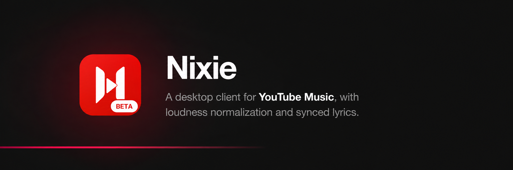
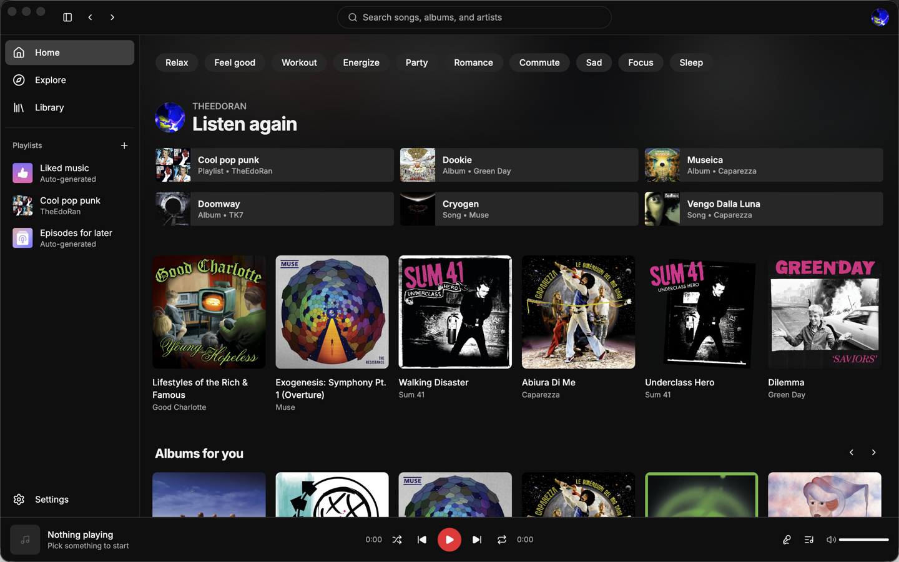
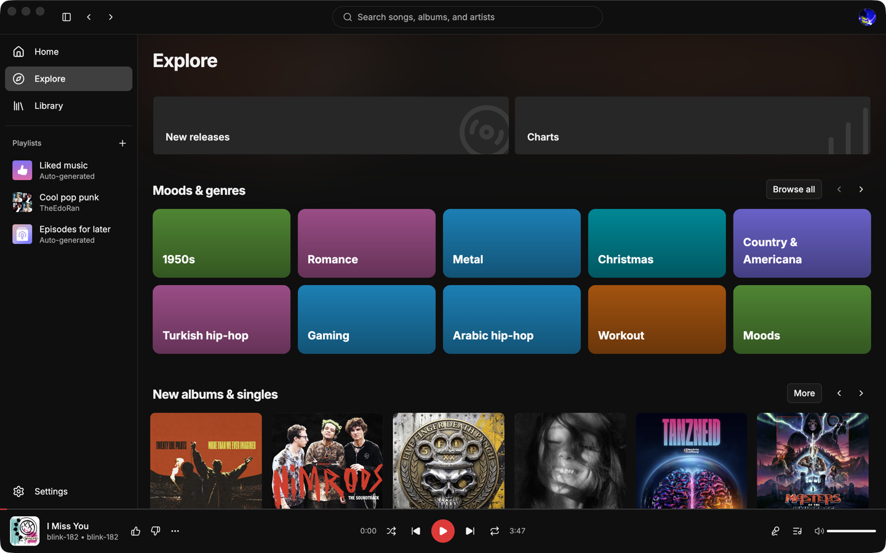
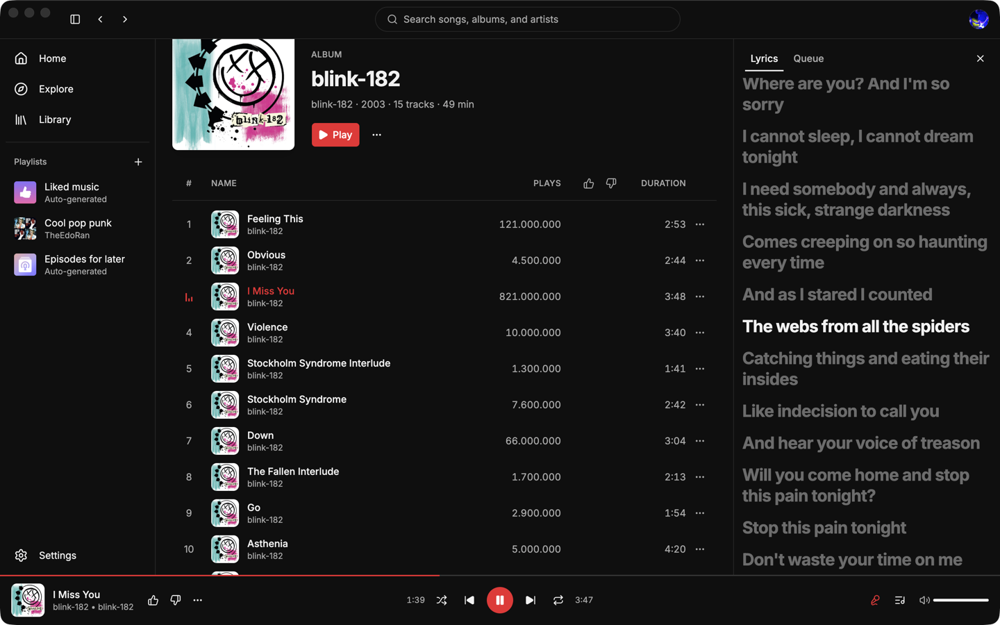
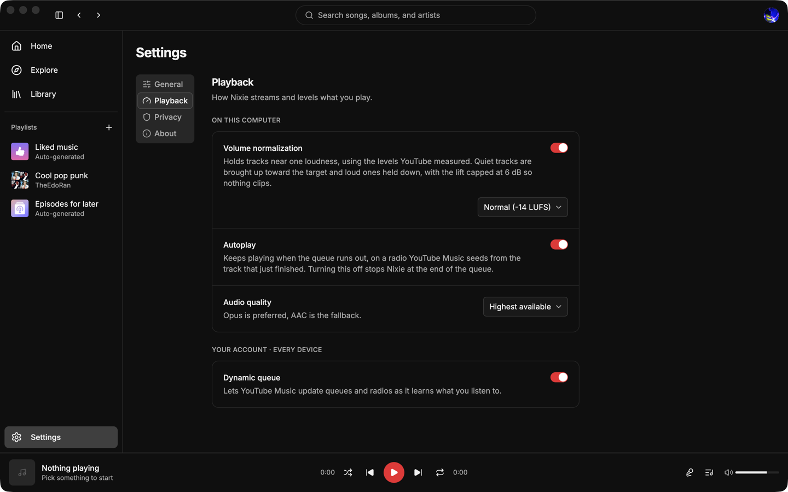

<p align="center">
  
</p>

<p align="center">
  <a href="https://github.com/NoctunePlayer/NoctuneDesktop/releases/latest"></a>
  <a href="LICENSE"></a>
  
  <a href="https://github.com/sponsors/TheEdoRan"></a>
</p>

Noctune is a desktop client for YouTube Music. It plays your account's music through a
native app instead of a browser tab: gapless playback, loudness normalization you can
actually set, time-synced lyrics, offline downloads, and a session that comes back exactly
where you left it.

It is an independent project. There is no Noctune account, no backend and no telemetry.
Everything it knows stays on your computer.

> [!IMPORTANT]
> **Noctune is beta software, and macOS only for now.** Things move, and some of them
> break. Builds are signed and notarized for Apple silicon and Intel. Windows and Linux
> are planned but have no date attached.

## Install

Grab the latest build from the [releases page](https://github.com/NoctunePlayer/NoctuneDesktop/releases/latest):

| File | For |
| --- | --- |
| `Noctune-<version>-applesilicon.dmg` | M1 and later |
| `Noctune-<version>-intel.dmg` | Intel Macs |

Every release is signed and notarized by Apple, the disk image as well as the app inside
it, so it opens on a double click with no right-click trick and no Gatekeeper warning at
either step. Once installed the app checks for updates on its own,
downloads them in the background, and asks nothing of you beyond a restart. If you never
restart, the update installs the next time you quit.

## Screenshots

<table>
  <tr>
    <td width="50%"></td>
    <td width="50%"></td>
  </tr>
  <tr>
    <td>Your home feed, mood chips and all</td>
    <td>Explore, with charts, moods and new releases</td>
  </tr>
  <tr>
    <td></td>
    <td></td>
  </tr>
  <tr>
    <td>Lyrics that follow the playhead, and seek when you click a line</td>
    <td>Loudness normalization, with a target you pick</td>
  </tr>
</table>

## Why I built it

I use YouTube Music every day and the official web app kept getting in the way. Three
things in particular, and each one is why a specific piece of this app exists.

**There is no loudness normalization you can set.** One track arrives mastered loud, the
next one quiet, and you spend the evening on the volume key. Noctune normalizes to a target
you choose: -19, -14 or -11 LUFS, the same three levels Spotify publishes, with -14 as the
default because that is what YouTube itself aims for. It reads the integrated loudness
YouTube already measured for each stream, so there is no analysis pass and no delay before
a track starts. Loud tracks are pulled all the way down; quiet ones are lifted, but never
by more than 6 dB, because YouTube publishes a loudness and not a true peak, and a quiet
master that is already peaking near full scale would clip if you lifted it blind.

**Nothing is where you left it.** Close the tab, come back, start over. Noctune saves the
queue, the current track, the exact position in it, the volume, and whether repeat and
shuffle were on. Reopen it and everything is there, paused, with the stream already
resolved so the first press of Space starts instantly. It comes back paused on purpose:
an app that starts making noise before you have asked it to is not a feature.

**Lyrics are plain text, when they are there at all.** Noctune asks three sources in
order, LRCLIB, then NetEase, then YouTube Music itself, and prefers a time-synced result
over a plain one regardless of which source it came from. Synced lyrics highlight the line
you are on, scroll to keep it in view, and seek when you click one. It stops at the first
source good enough, so most tracks never get past the first request.

Beyond those three, it is simply nicer to use: a real track table with sortable columns of
information, a persistent player, a queue you can see, keyboard shortcuts, media keys, and
Now Playing in Control Center. It is a desktop app, not a web page in a frame.

## Features

**Playback**

- Gapless playback with two audio decks. The handoff is armed before the boundary rather
  than triggered when a track ends, so joins are seamless even on a minimized window.
- Loudness normalization at -19, -14 or -11 LUFS, or off.
- A volume slider that behaves like your ears do, not like a gain multiplier.
- Queue with play next, add to queue, reorder and remove. Repeat off, all or one. Shuffle.
- Radio from any track, album, artist or playlist.
- Autoplay that extends an exhausted queue a full track before the end, so the music never
  stops to wait for a network request.
- Three audio quality levels: data saver, balanced, or highest available.

**Lyrics**

- Time-synced when a source has them, plain text when it does not, and an explicit
  "instrumental" when the track has none to find.
- Click any line to seek to it.
- Lyric requests carry no cookie and identify neither you nor the account, except to
  YouTube Music, which is asked over the session already streaming the audio.

**Library and browsing**

- The home feed with its mood chips and infinite scrolling.
- Explore, including charts per country.
- Search with live suggestions, and filters for songs, albums, artists and playlists.
- Album, artist and playlist pages.
- Create, rename, describe, reorder, edit privacy on and delete playlists. Add and remove
  tracks. Like, dislike, save to library, subscribe to artists.

**Offline**

- Download a track, an album or a whole playlist to disk.
- Downloaded tracks play from the file, with their measured loudness stored alongside, so
  normalization still applies offline.

**macOS**

- Now Playing in Control Center, with artwork, and hardware media keys.
- A quiet notification naming the next track when the queue moves on by itself. Never
  while the window is focused, and never with a sound, because the only sound this app
  makes is the music.
- Automatic updates.

**Privacy and security**

- No account, no backend, no telemetry, no analytics, no crash uploader.
- Sandboxed renderer, context isolation, a strict content security policy, and validated
  IPC. Media and artwork are served through a restricted custom protocol, so the renderer
  never holds a signed URL or a filesystem path.
- See [PRIVACY.md](PRIVACY.md) for exactly what is stored and what leaves the machine,
  and [SECURITY.md](SECURITY.md) for how to report a vulnerability.

## How signing in works

Google refuses sign-in from an embedded browser window, and refuses OAuth tokens on the
endpoints this app talks to. So Noctune does not ask for your password at all. Instead it
adopts the session from a browser you are already signed in to on the same machine.

Pick a profile from Chrome, Brave, Edge, Vivaldi or Chromium on macOS, or Firefox on any
platform, and Noctune reads that profile's YouTube cookies. They go into a dedicated
Electron session partition and nowhere else. They are never logged, never sent anywhere
except YouTube, and never exposed to the app's interface. Google expires the session
every few minutes and only the browser holds the current value, so Noctune re-reads that
profile while it runs, at most once a minute, for as long as the account stays linked.
It is the only way in: there is no password field and no way to paste a session by hand.

Noctune reaches YouTube through the private interface the YouTube Music apps use, which
Google does not publish or support. Nothing about you leaves this device to anyone else,
but the account you link is talking to YouTube through an unofficial client, and it
carries whatever risk that brings.

Once the session is adopted, Noctune checks that the account holds a Music Premium
subscription, by asking YouTube what audio tiers it is willing to offer: the 256 kbps
tiers are offered to a subscriber and to nobody else. An account without one is refused
and nothing is stored for it. If that check cannot reach YouTube at all it lets you
through, because a network failure is not evidence about anybody's subscription.

Signing out clears the session and the parser cache.

## Sponsorship

Noctune is free, MIT licensed, and has no paid tier or premium build. It does cost
something to ship, though.

A Mac app that opens without a scary dialog has to be signed and notarized by Apple, and
that requires an Apple Developer Program membership at 99 USD a year, renewed whether or
not anyone downloads a single build. The rest is time: reading upstream responses that
changed overnight, chasing a race in the audio engine, keeping three lyric providers
working, and eventually getting Windows and Linux out the door.

If Noctune is what you listen to, [sponsoring it](https://github.com/sponsors/TheEdoRan)
covers that and buys more of it. Any amount helps, and it is the difference between this
being a project I maintain and a project I get to work on.

<p>
  <a href="https://github.com/sponsors/TheEdoRan"></a>
</p>

## Development

### What you need

- **Node 26** and **pnpm 11.16.0**, both exactly. `engines` is strict and `.node-version`
  is there for anyone using a version manager.
- **macOS**, with the Xcode command line tools installed (`xcode-select --install`). The
  dev setup script uses `plutil`, `sips` and `codesign`.

You do not need an Apple Developer account to build and run the app. That is only for
producing signed, notarized releases, and [docs/signing.md](docs/signing.md) covers it.

### Getting it running

```sh
git clone https://github.com/NoctunePlayer/NoctuneDesktop.git
cd NoctuneDesktop
pnpm install
pnpm dev
```

The app opens with a blue icon and calls itself Noctune (Dev). Sign in by picking a
browser profile, the same as the released app.

A few things happen on the way there that are worth knowing about, because they look
strange if you meet them by surprise:

- `pnpm install` runs `scripts/dev-app-name.mjs`. It renames the bundled Electron app to
  `Noctune.app`, sets its display name to "Noctune (Dev)", paints its icon blue, and then
  re-signs it ad hoc. That last step matters: editing an Electron bundle's `Info.plist`
  breaks the signature it ships with, and macOS silently refuses notifications from an app
  whose signature does not validate. The same script runs again on every `pnpm dev`, since
  anything that re-extracts `node_modules/electron` puts the stock bundle back.
- `pnpm dev` starts Vite on port 3000 for the renderer and compiles the main process and
  preload into `dist-electron/`, then launches Electron against them. All three reload on
  save.
- The dev build stores its data under `Noctune (Dev)`, separate from the released app. Its
  linked account, downloads, settings and playback state are its own, and you can run both
  at once.

### Before you push

```sh
pnpm check
```

That is the whole gate, and it is what CI runs on every pull request. In order it does
formatting (`oxfmt`), linting (`oxlint`), type checking (`tsc --noEmit`), unit tests
(`vitest`), route generation (`tsr generate`), and a production build. Run one test file
on its own with `pnpm vitest run src/lib/audio-engine.test.ts`, or `pnpm vitest` to watch.

### Where things are

| Path | What lives there |
| --- | --- |
| `electron/` | Main process: the YouTube adapter, the secure protocols, cookie import, lyrics, state, logging |
| `src/routes/` | Pages, as TanStack Router file routes with hash history. Data loading is loaders, there is no query client |
| `src/components/` | The shell, player bar, panels and dialogs. `ui/` is generated shadcn source |
| `src/lib/` | Renderer logic. `audio-engine.ts` owns playback and is framework-free and unit tested |
| `src/shared/` | Contracts and pure logic used on both sides of the process boundary |
| `scripts/` | Dev setup and release hooks |
| `build/` | Icons that electron-builder packages |

[AGENTS.md](AGENTS.md) is the architecture document. It is long, but it records why things
are the way they are, including several places where the obvious approach is the broken
one. Read the section covering whatever you are about to touch.

## Contributing

Bug reports, fixes and features are all welcome. Open an issue before starting anything
large, so nobody spends a weekend on a direction that was never going to land.

[CONTRIBUTING.md](CONTRIBUTING.md) has the conventions, the verification loop, and the
short list of things that will get a pull request turned down.

## Licence and legal

Noctune is [MIT licensed](LICENSE). See also [PRIVACY.md](PRIVACY.md),
[SECURITY.md](SECURITY.md) and [THIRD_PARTY_NOTICES.md](THIRD_PARTY_NOTICES.md).

Noctune is an independent project. It is not affiliated with, endorsed by, or sponsored by
YouTube, Google, Spotify, LRCLIB, or NetEase Cloud Music. YouTube and YouTube Music are
trademarks of Google LLC. You need your own YouTube Music account to use it, and your use
of that account remains subject to YouTube's terms.
